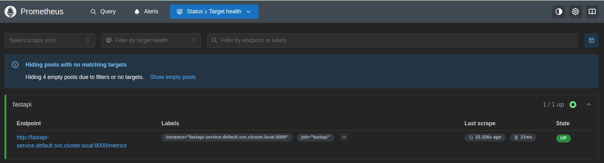
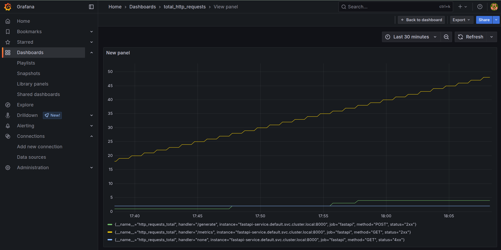
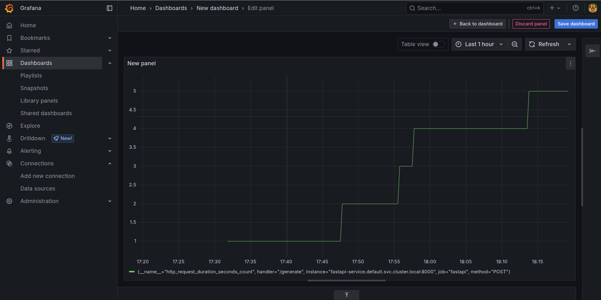

# LLM-Monitor 
## **Overview**  
This document outlines the monitoring setup for a FastAPI application that interacts with Mistral AI via Hugging Face’s inference API. The app is Dockerized, deployed on Minikube, and monitored using Prometheus and Grafana.  

---

## **Key Components**  
- **FastAPI App**: Handles requests to Mistral AI via Hugging Face’s API.  
- **Docker**: Containerizes the application for Kubernetes deployment.  
- **Minikube**: Local Kubernetes cluster for deployment.  
- **Prometheus**: Collects metrics from the FastAPI `/metrics` endpoint.  
- **Grafana**: Visualizes metrics scraped by Prometheus.  

---

## **Examples of Metrics Tracked**  

### 1. **Prometheus Scraping Verification**  

  
   
 

  
    
- **Description**: Confirms Prometheus is successfully scraping metrics from the FastAPI `/metrics` endpoint.. 

### 2. **Total Requests in Grafana**  

  
   

- **Metric**: `http_requests_total`  
- **Description**: Tracks total HTTP requests to all endpoints (e.g., `/generate`, `/metrics`).  
- **Use Case**: Monitor overall API traffic and usage trends.  

### 3. **/generate Endpoint Requests**  

  
   

- **Metric**: `http_requests_total{handler="/generate"}`  
- **Description**: Isolates requests to the `/generate` endpoint, which interacts with Mistral AI.  
- **Use Case**: Track usage and performance of the LLM interaction endpoint.  

In addition to request counts and endpoint usage, this monitoring setup can track metrics such as request latency (response times), error rates, status code distributions, request and response sizes, and overall application health—providing a comprehensive view of your FastAPI service’s performance.

---

## Conclusion

I have built a FastAPI application that interacts with Mistral AI using Hugging Face, containerize it with Docker, and deploy it on Minikube. By integrating Prometheus and Grafana, the project achieves real-time monitoring and visualization of application metrics.

With this setup, we can:
- Track API usage and performance,
- Monitor specific endpoints like `/generate`,
- Quickly identify issues or unusual patterns,
- And gain valuable insights into your application's health and behavior.

Overall, this approach provides a solid foundation for developing, deploying, and maintaining reliable, observable, and scalable AI-powered services.
